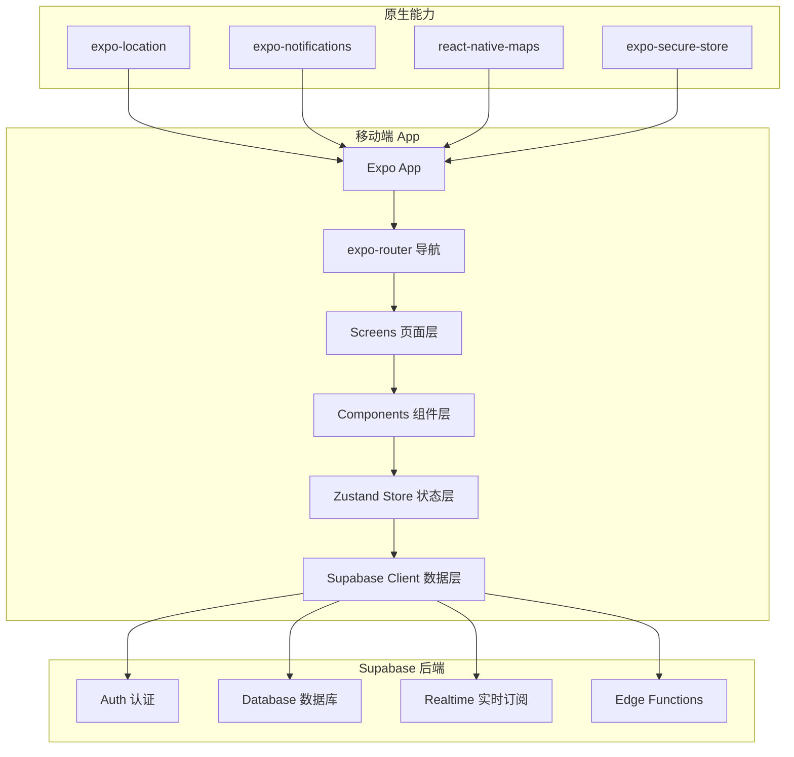

## 用户需求

将现有 Web 版"此时此地"（Nut）项目迁移为移动端原生 App，支持 iOS + Android 双平台。

## 产品概述

"此时此地"是一个基于地理位置的即时社交平台，核心理念是让社交回归真实的物理空间与"此时此刻"，通过空间围栏过滤社交噪音。

## 核心功能

1. **地图与定位**：高精度定位（GPS + WiFi），地图展示附近内容
2. **位置留言（Notes）**：在当前位置发布带有时效性的留言，支持快讯（24h）、日常（7d）、永久三种类型
3. **即时聊天室（Rooms）**：创建/加入基于位置的临时或永久聊天室，支持实时消息订阅
4. **用户系统**：邮箱注册/登录、个人资料管理、信用分体系
5. **空间围栏**（规划中）：地理边界检测，进入/离开围栏触发事件

## 原生 App 特有需求

- 后台持续定位能力
- 原生推送通知
- 应用商店分发（App Store / Google Play）
- 更好的地图交互性能

## 技术栈选型

### 框架推荐：React Native + Expo

| 维度 | React Native + Expo | Flutter | 原生开发 |
| --- | --- | --- | --- |
| 学习曲线 | 低（复用 React 经验） | 中（学习 Dart） | 高（Swift + Kotlin） |
| 代码复用 | Zustand/业务逻辑可复用 | 需完全重写 | 需维护两套代码 |
| 原生能力 | Expo 提供丰富模块 | 完善 | 最佳 |
| 开发效率 | 高 | 高 | 低 |
| 性能 | 优秀 | 优秀 | 最佳 |
| 生态成熟度 | 非常成熟 | 成熟 | 成熟 |


**推荐理由**：

1. 团队已有 React + Zustand 经验，迁移成本最低
2. Supabase 提供官方 React Native SDK，后端无需改动
3. Expo 提供 expo-location（高精度定位）、expo-notifications（推送）、react-native-maps（地图）等成熟模块
4. 单代码库支持 iOS + Android，EAS Build 简化发布流程

### 核心依赖

| 功能 | 库/模块 | 说明 |
| --- | --- | --- |
| 框架 | Expo SDK 53+ | Expo 托管工作流 |
| 导航 | expo-router | 文件系统路由，类似 Next.js |
| 状态管理 | Zustand | 直接复用现有逻辑 |
| 后端 | @supabase/supabase-js | 官方 SDK，Auth + Realtime |
| 地图 | react-native-maps | Google Maps / Apple Maps |
| 定位 | expo-location | 前台/后台定位、地理围栏 |
| 推送 | expo-notifications | APNs / FCM 统一接口 |
| 存储 | expo-secure-store | 安全存储敏感数据 |
| UI 组件 | React Native Paper 或 NativeWind | Material Design 3 或 Tailwind 风格 |


### 后端架构（保持不变）

现有 Supabase 后端完全兼容 React Native，无需改动：

- PostgreSQL 数据库
- Supabase Auth（邮箱登录）
- Supabase Realtime（消息订阅）
- Row Level Security（数据权限）

## 实现方案

### 系统架构



### 核心模块设计

**1. 定位服务（LocationService）**

- 前台定位：获取当前位置，更新地图中心
- 后台定位：监听位置变化，触发围栏事件
- 地理围栏：expo-location 的 startGeofencingAsync API

**2. 地图模块（MapView）**

- 使用 react-native-maps 替代 MapLibre GL
- 支持自定义 Marker（留言、聊天室标记）
- 点击地图创建留言/聊天室

**3. 实时消息（RealtimeService）**

- 复用现有 Supabase Realtime 订阅逻辑
- 适配 React Native 生命周期（AppState 处理前后台切换）

**4. 推送通知（NotificationService）**

- expo-notifications 注册设备 Token
- 存储 Token 到 Supabase users 表
- 使用 Supabase Edge Functions 发送推送

### 数据模型扩展

现有数据模型保持不变，新增字段：

```sql
-- users 表新增
ALTER TABLE users ADD COLUMN push_token TEXT;
ALTER TABLE users ADD COLUMN device_type TEXT; -- 'ios' | 'android'

-- 未来围栏功能
CREATE TABLE fences (
  id UUID PRIMARY KEY DEFAULT gen_random_uuid(),
  creator_id UUID REFERENCES users(id),
  name TEXT NOT NULL,
  center_lat DOUBLE PRECISION NOT NULL,
  center_lng DOUBLE PRECISION NOT NULL,
  radius INTEGER NOT NULL, -- 米
  start_time TIMESTAMPTZ,
  end_time TIMESTAMPTZ,
  is_public BOOLEAN DEFAULT true,
  password TEXT,
  created_at TIMESTAMPTZ DEFAULT NOW()
);
```

## 实现注意事项

### 性能优化

- 地图 Marker 数量控制：使用聚合算法（clustering）处理大量标记点
- 列表渲染：使用 FlashList 替代 FlatList 提升长列表性能
- 图片加载：使用 expo-image 实现渐进式加载和缓存

### 安全性

- 使用 expo-secure-store 存储敏感数据（Token、密钥）
- 所有 API 请求通过 Supabase RLS 控制权限
- 位置数据精度降级处理，保护用户隐私

### 兼容性

- iOS 最低版本：iOS 14+
- Android 最低版本：API 24 (Android 7.0+)
- 处理 Android 后台定位权限申请流程

## 目录结构

```
nut-mobile/
├── app/                           # [NEW] expo-router 页面目录
│   ├── _layout.tsx                # [NEW] 根布局，包含 Tab 导航和全局 Provider
│   ├── index.tsx                  # [NEW] 入口，重定向到登录或首页
│   ├── login.tsx                  # [NEW] 登录页，邮箱注册/登录表单
│   ├── (tabs)/                    # [NEW] Tab 导航组
│   │   ├── _layout.tsx            # [NEW] Tab 导航配置（首页/消息/我的）
│   │   ├── index.tsx              # [NEW] 首页，地图 + 附近留言/聊天室列表
│   │   ├── chat.tsx               # [NEW] 消息页，聊天室列表和聊天界面
│   │   └── profile.tsx            # [NEW] 个人中心，资料编辑和我的内容
│   └── room/
│       └── [id].tsx               # [NEW] 聊天室详情页，动态路由
├── components/                    # [NEW] 可复用组件
│   ├── NoteCard.tsx               # [NEW] 留言卡片，展示留言内容和元信息
│   ├── RoomCard.tsx               # [NEW] 聊天室卡片，展示聊天室信息和加入按钮
│   ├── MessageBubble.tsx          # [NEW] 消息气泡，区分自己和他人消息样式
│   ├── WriteNoteSheet.tsx         # [NEW] 写留言底部弹窗，包含内容输入和时效选择
│   ├── CreateRoomSheet.tsx        # [NEW] 创建聊天室底部弹窗
│   └── MapMarker.tsx              # [NEW] 自定义地图标记，区分留言和聊天室
├── stores/                        # [NEW] Zustand 状态管理
│   ├── useAuthStore.ts            # [NEW] 认证状态，用户信息和登录/登出方法
│   ├── useLocationStore.ts        # [NEW] 位置状态，当前位置和权限状态
│   ├── useNotesStore.ts           # [NEW] 留言状态，附近留言列表和 CRUD 操作
│   ├── useRoomsStore.ts           # [NEW] 聊天室状态，房间列表和消息
│   └── useAppStore.ts             # [NEW] 应用状态，UI 状态和导航状态
├── services/                      # [NEW] 业务服务层
│   ├── supabase.ts                # [NEW] Supabase 客户端初始化
│   ├── LocationService.ts         # [NEW] 定位服务，前台/后台定位和围栏
│   ├── NotificationService.ts     # [NEW] 推送服务，Token 注册和通知处理
│   └── RealtimeService.ts         # [NEW] 实时订阅服务，消息和数据变更监听
├── hooks/                         # [NEW] 自定义 Hooks
│   ├── useLocation.ts             # [NEW] 位置 Hook，封装定位权限和状态
│   ├── useRealtime.ts             # [NEW] 实时订阅 Hook，管理 Supabase Channel
│   └── useAuth.ts                 # [NEW] 认证 Hook，封装登录状态检查
├── utils/                         # [NEW] 工具函数
│   ├── formatters.ts              # [NEW] 格式化函数，时间、距离等
│   └── validators.ts              # [NEW] 验证函数，邮箱、密码等
├── constants/                     # [NEW] 常量定义
│   └── config.ts                  # [NEW] 应用配置，API URL、颜色主题等
├── types/                         # [NEW] TypeScript 类型定义
│   └── index.ts                   # [NEW] 全局类型，User、Note、Room、Message 等
├── app.json                       # [NEW] Expo 配置，应用名称、图标、权限等
├── package.json                   # [NEW] 依赖配置
├── tsconfig.json                  # [NEW] TypeScript 配置
└── eas.json                       # [NEW] EAS Build 配置，iOS/Android 构建配置
```

## 关键代码结构

### 类型定义

```typescript
// types/index.ts
export interface User {
  id: string;
  email: string;
  nickname: string | null;
  avatar_url: string | null;
  credit_score: number;
  push_token: string | null;
  created_at: string;
}

export interface Note {
  id: string;
  user_id: string;
  lat: number;
  lng: number;
  content: string;
  expiry: '24h' | '7d' | 'permanent';
  likes_count: number;
  created_at: string;
  users?: Pick<User, 'nickname' | 'avatar_url'>;
}

export interface Room {
  id: string;
  user_id: string;
  lat: number;
  lng: number;
  name: string;
  type: 'temp' | 'permanent';
  expires_at: string | null;
  created_at: string;
  users?: Pick<User, 'nickname'>;
}

export interface Message {
  id: string;
  room_id: string;
  user_id: string;
  content: string;
  type: 'text' | 'image';
  created_at: string;
  users?: Pick<User, 'nickname' | 'avatar_url'>;
}

export interface LocationCoords {
  lat: number;
  lng: number;
}
```

### 定位服务接口

```typescript
// services/LocationService.ts
export interface ILocationService {
  requestPermissions(): Promise<boolean>;
  getCurrentLocation(): Promise<LocationCoords>;
  startWatching(callback: (location: LocationCoords) => void): Promise<void>;
  stopWatching(): void;
  startGeofencing(fenceId: string, center: LocationCoords, radius: number): Promise<void>;
  stopGeofencing(fenceId: string): Promise<void>;
}
```

### Zustand Store 接口

```typescript
// stores/useAuthStore.ts
export interface AuthStore {
  user: User | null;
  isLoading: boolean;
  setUser: (user: User | null) => void;
  signIn: (email: string, password: string) => Promise<void>;
  signUp: (email: string, password: string) => Promise<void>;
  signOut: () => Promise<void>;
  updateProfile: (data: Partial<User>) => Promise<void>;
}
```

## Agent Extensions

### SubAgent

- **Flutter Specialist（Flutter开发专家）**
- Purpose: 如果用户后续考虑 Flutter 方案，可调用此 SubAgent 获取 Flutter 特定的最佳实践和性能优化建议
- Expected outcome: Flutter 架构设计和代码规范指导

- **用户体验流程专家 (The Flow Architect)**
- Purpose: 设计完整的用户旅程，包括定位权限申请流程、首次使用引导、异常状态处理
- Expected outcome: 完善的用户体验流程图和状态机设计

- **Vibe 调优与动效 (The Motion and Delight Agent)**
- Purpose: 为移动端 App 添加微交互和动画效果，提升产品质感
- Expected outcome: 动效设计规范和实现方案